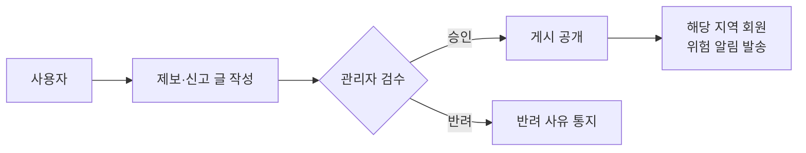
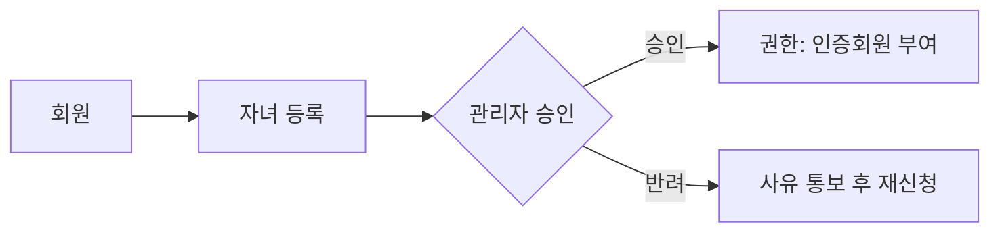

# I:ON 🚨🧒🛡️
> **아동 범죄 예방을 위한 지역 기반 커뮤니티 & 실시간 위험 알림 플랫폼**  
> 학부모의 불안감을 낮추고, **지도+커뮤니티+알림**으로 빠르게 대응합니다.

  
  
  
  
  
  

---

<b>📚 목차 (클릭하여 열기)</b>

- [배경](#-배경)
- [주제](#-주제)
- [목표](#-목표)
- [핵심 기능 한눈에 보기](#-핵심-기능-한눈에-보기)
- [기능 상세](#-기능-상세)
  - [회원/인증](#-회원인증)
  - [커뮤니티/게시판](#-커뮤니티게시판)
  - [지도 기반 안전 정보](#-지도-기반-안전-정보)
  - [마이페이지](#-마이페이지)
  - [관리자 기능](#-관리자-기능)
  - [채팅 & 알림](#-채팅--알림)
- [역할과 권한](#-역할과-권한)
- [신뢰도 & 배지](#-신뢰도--배지)
- [보안/개인정보 보호](#-보안개인정보-보호)
- [기술 스택](#-기술-스택)
- [흐름도(Flow)](#-흐름도flow)
- [운영 메모](#-운영-메모)
- [향후 확장 로드맵](#-향후-확장-로드맵)
- [라이선스](#-라이선스)

---

## 🔎 배경
아동 대상 범죄는 매년 꾸준히 발생하며 아동은 상황에 **매우 취약**합니다.  
현재 학부모들은 맘카페 등 일반 커뮤니티에 의존하지만, **아동 안전 특화 플랫폼**은 드뭅니다.  
또한 위험 지역, 실종 정보, 성범죄자 거주지 등 **데이터가 흩어져** 있어 **지도 기반 통합 제공**과 **경고 알림**이 부족합니다.

## 🎯 주제
**“아동 범죄 예방을 위한 지역 기반 커뮤니티 및 실시간 위험 정보 제공 플랫폼 구축”**  
→ 학부모에게 **신뢰도 높은 정보 공유**와 **실시간 예방/대응**을 제공하는 통합 안전 커뮤니티

## 🏁 목표
- ✅ **학부모 인증 기반 커뮤니티**로 신뢰 강화  
- ✅ **위치 기반 범죄 정보 & 경고 알림**으로 선제적 예방  
- ✅ **실종/범죄 제보 시스템**으로 신속 대응 체계 구축  
- ✅ **신뢰도 점수/배지**로 건강한 참여 문화 유도  
- ✅ **관리자 정보 콘텐츠**로 예방 교육 강화

---

## ✨ 핵심 기능 한눈에 보기
- 🔐 회원가입(자체/네이버), 로그인 유지, 자동 로그아웃, CAPTCHA
- 👪 자녀 등록 → 관리자 승인 시 **인증회원** 권한
- 🗂️ 게시판: **자유 / 정보 공유 / 제보·신고 / 실종·유괴 / 위탁**
- 🗺️ 지도에서 **범죄 발생 지역·성범죄자 거주지·비상벨·안심 지킴이집** 확인
- 🚨 제보·신고 **승인 시 해당 지역 회원에게 위험 알림**
- 🏅 활동에 따른 **신뢰도/배지**를 닉네임 옆에 표시
- 💬 **1:1 채팅**, 🛎️ 읽지 않은 채팅/글·댓글 별도 알림
- 🛠️ 관리자: 승인/삭제/정지, 전용 정보 콘텐츠 발행

---

## 🧩 기능 상세

### 🔐 회원/인증
- **회원가입**
  - 자체 가입: 비밀번호 **암호화 저장**, **CAPTCHA** 필수
  - 네이버 OAuth 간편 가입
- **로그인**
  - 로그인 유지 옵션: 브라우저 종료 후 **1시간 자동 유지**
  - **자동 로그아웃**: 1시간 미활동 · 타 기기/위치 재로그인 감지
- **권한 승격**
  - **자녀 등록 → 관리자 승인** 시 인증회원 권한 부여
- **계정 관리**
  - 회원 정보 수정(**30일 1회 제한**), 탈퇴

### 🗣️ 커뮤니티/게시판
- 게시판 구성: **자유 / 위탁 / 실종·유괴 / 제보·신고 / 정보 공유**
- 접근 정책
  - 일반 회원: 자유, 정보 공유(열람)
  - 정보 공유: **관리자만 작성**, 회원 열람
  - 제보·신고: **관리자 승인 후 공개**, 승인 시 **지역 위험 알림**
- 참여 보상
  - 글/댓글 활동 기반 **신뢰도 상승**, **배지**가 닉네임 옆에 노출

### 🗺️ 지도 기반 안전 정보
- 현재 위치 기반으로 아래 정보를 시각화
  - 📍 **범죄 발생 지역**
  - 🏠 **성범죄자 거주지**
  - 🛎️ **비상벨**
  - 🛡️ **안심 지킴이집**
- 위험 요소 클릭 시 **관련 게시글/제보로 연결**

### 🙋‍♀️ 마이페이지
- 내가 쓴 글/댓글, 받은 댓글 **한눈에**
- **거주 지역 위험 알림** 내역
- 회원 정보 수정/탈퇴, 활동 이력 관리
- 닉네임 클릭 시 **상대 마이페이지** 진입(공개 범위 제한 적용)

### 🛠️ 관리자 기능
- **자녀 등록 승인**, **제보·신고 승인/반려**
- 게시글/댓글 **삭제** 및 신고 처리
- 회원 **일시 정지**
- **정보 공유 게시판** 콘텐츠 발행

### 💬 채팅 & 🛎️ 알림
- 회원 간 **1:1 실시간 채팅**
- **읽지 않은 채팅** 전용 알림
- 글/댓글 알림과 **분리된 채팅 알림**
- **제보·신고 승인 시** 해당 지역 회원에게 **위험 알림** 발송

---

## 🧭 역할과 권한

| 역할 | 읽기 | 작성/수정 | 특이 사항 |
|---|---|---|---|
| 👀 비회원 | 공개 페이지 | - | 회원가입/로그인만 가능 |
| 👤 일반 회원 | 자유, 정보 공유(열람) | 자유(작성), 정보 공유(작성 불가) | 1:1 채팅 사용 |
| 🛡️ **인증회원** | 전 게시판 | 자유/위탁/실종·유괴/제보·신고 등 | 제보·신고는 **승인 후 공개** |
| 🧰 **관리자** | 전 영역 | 전 영역 | 승인/반려, 삭제, 정지, 관리자 전용 글 작성 |

---

## 🏅 신뢰도 & 배지
- **신뢰도 점수**: 글/댓글 등 커뮤니티 활동을 지표화  
- **닉네임 옆 배지**로 활동 등급 시각화  
- 예시 등급
  - <kbd>🌱 새싹 보호자</kbd> (0~9점)
  - <kbd>🛡️ 안심 지킴이</kbd> (10~29점)
  - <kbd>🏆 최고 안전 수호자</kbd> (30점 이상)
- 등급/점수 기준은 **운영 정책에 따라 조정** 가능

---

## 🔒 보안/개인정보 보호
- 🔑 비밀번호 **암호화 저장**
- 🤖 **CAPTCHA**로 로봇 가입 방지
- ⏱️ **세션 타임아웃** & **중복 로그인 차단**
- 🧩 역할 기반 접근 제어(RBAC), 제보/신고 **사전 검수**

---

## 🧰 기술 스택
- **Backend**: Java 11 · Spring MVC · Spring Security · MyBatis  
- **View**: JSP · JSTL · (jQuery/AJAX · Bootstrap)  
- **DB**: MySQL 8  
- **Infra**: Apache Tomcat 9 (WAR 배포)  
- **Auth**: 네이버 OAuth  
- **기타**: 지도/마커 렌더링, 지역 기반 알림

> 실제 저장소 버전/구성은 프로젝트 설정에 따라 달라질 수 있습니다.

---

## 🗺️ 흐름도(Flow)

### 제보·신고 승인 & 지역 알림

### 인증회원 권한 승급

---

## 📝 운영 메모
- **회원 인증 흐름**: (자체/네이버) 가입 → CAPTCHA → 로그인 유지(1h) → 미활동/중복 로그인 시 자동 로그아웃  
- **제보·신고 공개 흐름**: 작성 → 관리자 승인 → **지역 위험 알림** → 게시  
- **권한 승격**: 자녀 등록 → 관리자 승인 → 인증회원  
- **정보 공유 게시판**: 관리자 작성, 회원 열람

---

## 🚀 향후 확장 로드맵
- [ ] 모바일 푸시(Firebase 등)로 **시간·위치 기반 위험 알림** 고도화
- [ ] **익명 제보 보호** 레이어 도입(추적 불가 토큰화)
- [ ] **공공데이터/지자체** 연동 파이프라인로 최신성 보장
- [ ] 지도 **클러스터링/필터** 및 **위험도 지수** 시각화
- [ ] **콘텐츠 모듈화**(예: 안전 교육 카드/퀴즈)

---

## 📄 라이선스
본 저장소의 라이선스 정책을 `LICENSE` 파일에 명시해 주세요.

---

### 💡 한 줄 요약
**I:ON**은 학부모 인증 기반의 **신뢰 커뮤니티**와 **지도·알림**을 결합해, 아동 범죄를 **사전에 예방**하고 **신속 대응**을 돕는 플랫폼입니다.
